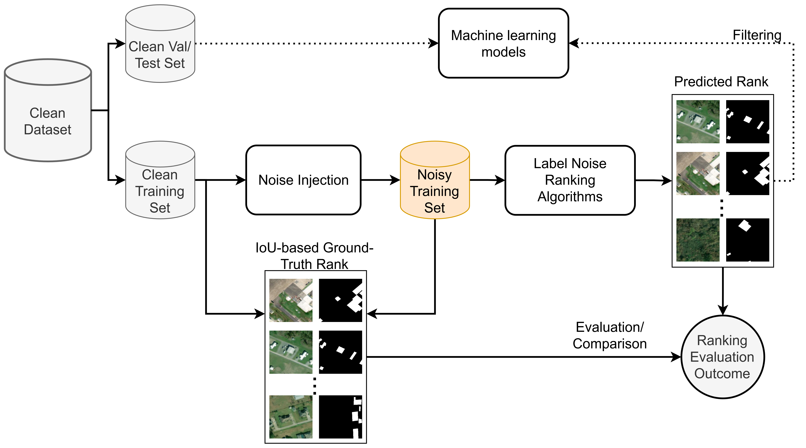

# Data-Centric Benchmark for Label Noise Estimation and Ranking in Remote Sensing Image Segmentation

High-quality pixel-level annotations are essential for the semantic segmentation of remote sensing imagery. However, such labels are expensive to obtain and often affected by noise due to the labor-intensive and time-consuming nature of pixel-wise annotation, which makes it challenging for human annotators to label every pixel accurately. Annotation errors can significantly degrade the performance and robustness of modern segmentation models, motivating the need for reliable mechanisms to identify and quantify noisy training samples. This paper introduces a novel Data-Centric benchmark, together with a novel, publicly available dataset and two techniques for identifying, quantifying, and ranking training samples according to their level of label noise in remote sensing semantic segmentation. Such proposed methods leverage complementary strategies based on model uncertainty, prediction consistency, and representation analysis, and consistently outperform established baselines across a range of experimental settings.

## Usage

Each folder has one method with its own requirements and usage explanations.

## Dataset

The proposed Clean/Noise Building Segmentation Dataset is available on [Zenodo](https://zenodo.org/records/19193343).

## Citing

If you use this code in your research, please consider citing:

    @article{nogueira2026data,
	  title={Data-Centric Benchmark for Label Noise Estimation and Ranking in Remote Sensing Image Segmentation},
	  author={Nogueira, Keiller and Diaconu, Codrut-Andrei and Kerekes, D{\'a}vid and Gawlikowski, Jakob and L{\'e}onard, C{\'e}dric and Braham, Nassim Ait Ali and Goo, June Moh and Zeng, Zichao and Liu, Zhipeng and Jain, Pallavi and others},
	  journal={arXiv preprint arXiv:2603.00604},
	  year={2026}
	}

